# Multi-Container Runtime — Project Submission

# **Team Information**
>## - Student 1: [Aayushman Singh] — SRN: [PES1UG24AM006]
>## - Student 2: [Akshit Singhal] — SRN: [PES1UG24AM027]

---

#Project Summary
##This project implements a lightweight Linux container runtime in C with:

- A user-space supervisor to manage multiple containers
- A kernel module to monitor and enforce memory limits
- A logging system using a bounded buffer and pipes
- A CLI interface for container lifecycle management
- Scheduling experiments demonstrating Linux CPU scheduling behavior


## Table of Contents
1. [Build, Load, and Run Instructions](#build-load-and-run-instructions)
2. [Demo with Screenshots](#demo-with-screenshots)
3. [Test Cases and Expected Outputs](#test-cases-and-expected-outputs)
4. [Engineering Analysis](#engineering-analysis)
5. [Design Decisions and Tradeoffs](#design-decisions-and-tradeoffs)

---

## Build, Load, and Run Instructions

### Prerequisites

Ubuntu 22.04 or 24.04 VM with **Secure Boot OFF** (required for kernel module loading). WSL will not work.

```bash
sudo apt update
sudo apt install -y build-essential linux-headers-$(uname -r)
```

### Step 1 — Run Environment Preflight Check

```bash
chmod +x environment-check.sh
sudo ./environment-check.sh
```

This installs the required libraries and prepares the environment for the execution of the codes.
Fix any issues reported before continuing.

### Step 2 — Build Everything

```bash
make
```

This builds:
| Binary | Description |
|---|---|
| `engine` | User-space supervisor + CLI |
| `memory_hog` | Memory-pressure workload (statically linked) |
| `cpu_hog` | CPU-bound workload (statically linked) |
| `io_pulse` | I/O-bound workload (statically linked) |
| `monitor.ko` | Kernel memory monitor module |

CI-safe build (no kernel headers needed, used by GitHub Actions):
```bash
make ci
```

### Step 3 — Prepare Root Filesystems

```bash
mkdir rootfs-base
wget https://dl-cdn.alpinelinux.org/alpine/v3.20/releases/x86_64/alpine-minirootfs-3.20.3-x86_64.tar.gz
tar -xzf alpine-minirootfs-3.20.3-x86_64.tar.gz -C rootfs-base

# Copy workload binaries into base so all per-container copies get them
cp memory_hog cpu_hog io_pulse rootfs-base/

# Create one writable copy per container
cp -a rootfs-base rootfs-alpha
cp -a rootfs-base rootfs-beta
cp -a rootfs-base rootfs-gamma   # for third container experiments
```

### Step 4 — Load the Kernel Module

```bash
sudo insmod monitor.ko
ls -l /dev/container_monitor     # should appear
dmesg | tail -5                  # should show: [container_monitor] Module loaded
```

### Step 5 — Start the Supervisor (Terminal 1)

```bash
sudo ./engine supervisor ./rootfs-base
```

The supervisor runs in the foreground printing status messages. Open new terminals for CLI commands.

### Step 6 — Use the CLI (Terminal 2+)

```bash
# Start containers in background
sudo ./engine start c1 ./rootfs-alpha /bin/sh
sudo ./engine start c2 ./rootfs-beta /bin/sh
```
Or Alterbatively you can run:
```bash
sudo ./engine start alpha ./rootfs-alpha "/cpu_hog 20"
sudo ./engine start beta  ./rootfs-beta  "/cpu_hog 20" --nice 10
```

List containers
```bash
sudo ./engine ps
```

View logs
```bash
sudo ./engine logs alpha
```

Run a container in the foreground (blocks until it exits)
```bash
sudo ./engine run mem ./rootfs-gamma "/memory_hog 4 500" --soft-mib 20 --hard-mib 40
```

Stop a container
```bash
sudo ./engine stop alpha
```

### Step 7 — Teardown and Cleanup

```bash
# Stop supervisor with Ctrl-C or:
sudo kill -SIGTERM $(pgrep -f "engine supervisor")

# Verify no zombies
ps aux | grep defunct

# Unload kernel module
sudo rmmod monitor
dmesg | tail -5    # should show: [container_monitor] Module unloaded

# Clean build artifacts
make clean
```

---

# Demo with Screenshots

## 1) Multi-Container Supervision

#### In Terminal 1, start supervisor
```bash
sudo ./engine supervisor ./rootfs-base
```


#### Terminal 2 (supervisor already running)
```bash
sudo ./engine start alpha ./rootfs-alpha "/cpu_hog 30"
sudo ./engine start beta  ./rootfs-beta  "/cpu_hog 30"
# The supervisor terminal shows launch messages for both containers
```

Or Alterbatively you can run:
```bash
# Start containers in background
sudo ./engine start c1 ./rootfs-alpha /bin/sh
sudo ./engine start c2 ./rootfs-beta /bin/sh
```

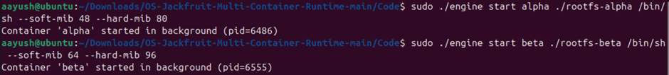

Supervisor Output:
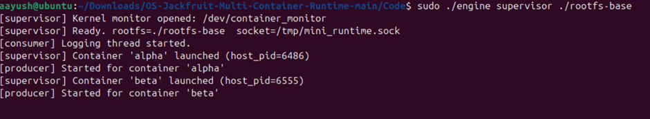

*Two containers (alpha, beta) launched under a single supervisor process. Supervisor shows host PIDs for both.*

---

## 2) Metadata Tracking
Command ran for this:

```bash
sudo ./engine ps
```

Expected output format:
```
CONTAINER_ID     PID      STATE              SOFT_MiB   HARD_MiB   NICE    STARTED
----------------  --------  ------------------  ----------  ----------  ------  --------
alpha             12345     running             40         64         0       14:30:01
beta              12346     running             40         64         10      14:30:02
```

Output:
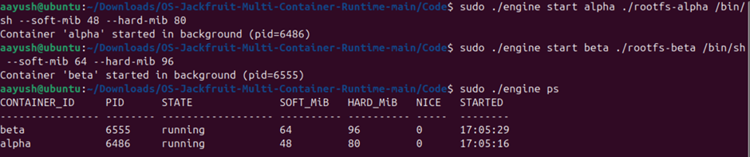

*`engine ps` showing both containers with state, memory limits, nice value, and start time.*

---

## 3) Bounded-Buffer Logging

```bash
sudo ./engine logs alpha
cat logs/alpha.log
```
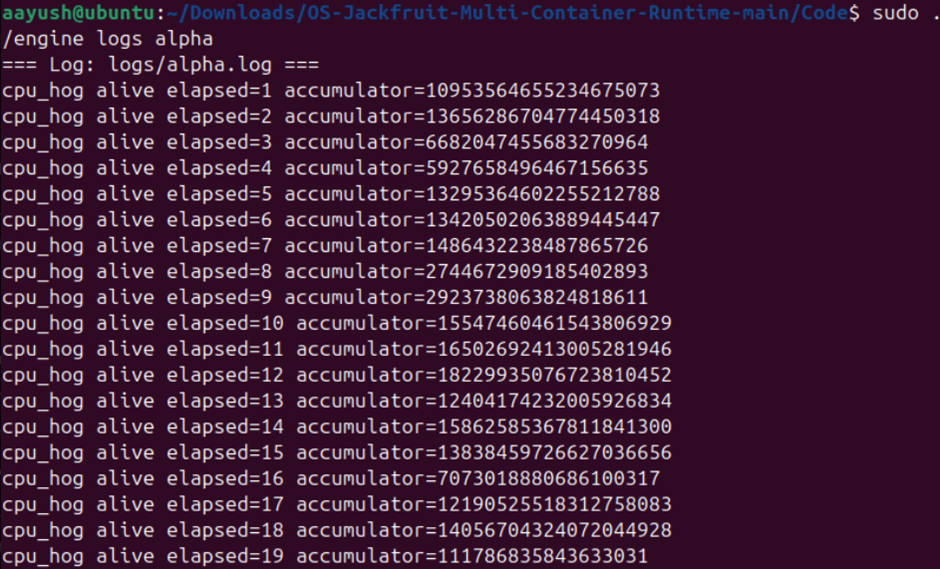

---

## 4) CLI and IPC

```bash
# In Terminal 2, issue a stop command and show it takes effect
sudo ./engine stop beta
sudo ./engine ps        # shows beta state changed to "stopped"
```


**Caption:** *`engine stop beta` sent over UNIX domain socket; supervisor responds and updates state. `engine ps` confirms state transition to `stopped`.*

---

## 5) Soft-Limit Warning

```bash
cp -a rootfs-base rootfs-mem
sudo ./engine run mem ./rootfs-mem "/memory_hog 4 500" --soft-mib 20 --hard-mib 80
# In another terminal, watch dmesg:
sudo dmesg -w | grep container_monitor
```

Expected `dmesg` output:
```
[container_monitor] Registering container=mem pid=XXXX soft=20971520 hard=83886080
[container_monitor] SOFT LIMIT container=mem pid=XXXX rss=21XXXXXX limit=20971520
```

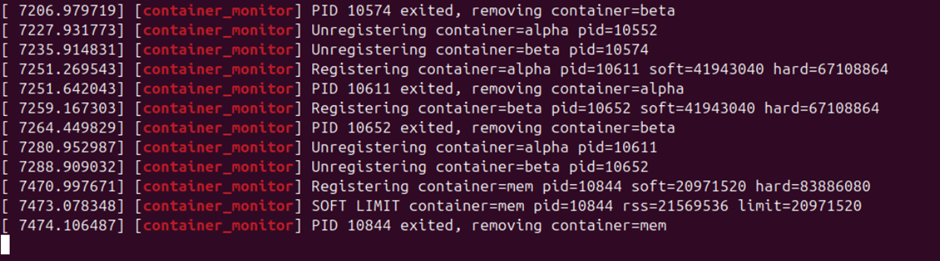

*Second Last Line shows the code crossing SOFT LIMIT. Kernel module emits SOFT LIMIT warning when container `mem` exceeds 20 MiB RSS. Warning appears exactly once.*

---

## 6) Hard-Limit Enforcement

```bash
cp -a rootfs-base rootfs-mem2
sudo ./engine run mem2 ./rootfs-mem2 "/memory_hog 4 500" --soft-mib 20 --hard-mib 40
# Container gets killed when it exceeds 40 MiB
sudo ./engine ps     # shows state = hard_limit_killed
sudo dmesg | grep -E "SOFT|HARD" | tail -5
```

Expected `ps` output:
```
mem2   XXXX   hard_limit_killed   20   40   0   14:35:10  (sig=9)
```

Expected `dmesg`:
```
[container_monitor] SOFT LIMIT container=mem2 pid=XXXX rss=21XXXXXX limit=20971520
[container_monitor] HARD LIMIT container=mem2 pid=XXXX rss=41XXXXXX limit=41943040
```


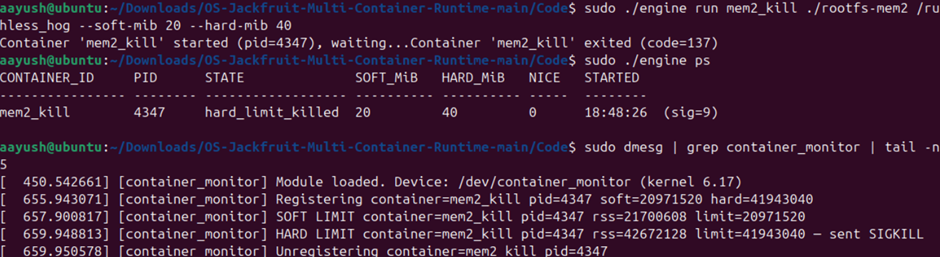

*Kernel module sends SIGKILL when container exceeds 40 MiB hard limit. Supervisor classifies exit as `hard_limit_killed` (SIGKILL with no `stop_requested`).*

---

## 7) Scheduling Experiment

```bash
cp -a rootfs-base rootfs-hi
cp -a rootfs-base rootfs-lo
# Start both simultaneously
sudo ./engine start hi ./rootfs-hi "/cpu_hog 20" --nice -5
sudo ./engine start lo ./rootfs-lo "/cpu_hog 20" --nice 15
sleep 25
# Check logs to compare progress
sudo ./engine logs hi | tail -8
sudo ./engine logs lo | tail -8
```

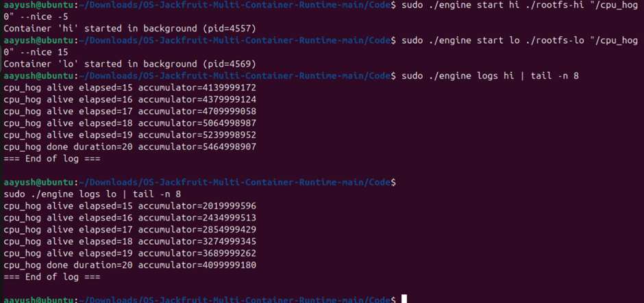

*Accumulator of `hi` Container `hi` (nice=-5, higher priority) completes more CPU iterations per second than `lo` (nice=15). CFS weight difference of ~40:1 causes clearly unequal CPU share.*

---

### 8 — Clean Teardown
**What to show:** No zombies after shutdown; supervisor exits cleanly; kernel module unloads.

```bash
# Stop supervisor (Ctrl-C in Terminal 1, or):
sudo kill -SIGTERM $(pgrep -f "engine supervisor")
```
Expected supervisor output:
```
[supervisor] Shutting down — sending SIGTERM to all containers...
[producer] EOF for container 'alpha', thread exiting.
[consumer] Logging thread exiting (buffer drained).
[supervisor] Clean shutdown complete.
```

Output:
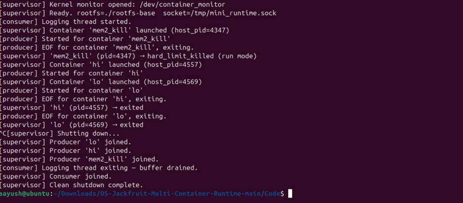
Supervisor Process has been Killed

```bash
# Check for zombies
ps aux | grep defunct

# Unload module
sudo rmmod monitor
dmesg | tail -3
```

Output:
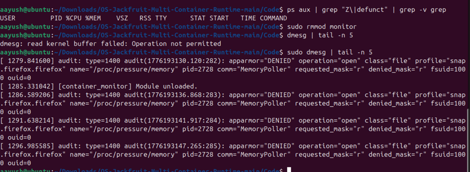


*Supervisor cleanly shuts down — producer threads join after pipe EOF, consumer thread drains buffer, no zombie processes, kernel module unloads successfully.*

---

## Test Cases and Expected Outputs

### Test Case 1 — Basic Container Launch and Lifecycle


**Steps:**
```bash
sudo ./engine start alpha ./rootfs-alpha "/cpu_hog 10"
sudo ./engine ps
sleep 12
sudo ./engine ps   # alpha should now show state=exited
```

**Expected output (ps before exit):**
```
CONTAINER_ID  PID    STATE    SOFT_MiB  HARD_MiB  NICE  STARTED
alpha         XXXXX  running  40        64        0     HH:MM:SS
``

**Expected output (ps after exit):**
```
alpha         XXXXX  exited   40        64        0     HH:MM:SS  (exit=0)
```
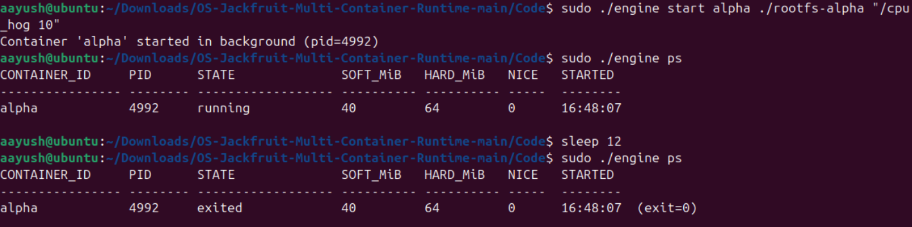

**Pass criteria:** Container launched, runs, exits cleanly, state shown as `exited`.

---

### Test Case 2 — Multiple Concurrent Containers

**Steps:**
```bash
sudo ./engine start alpha ./rootfs-alpha "/cpu_hog 20"
sudo ./engine start beta  ./rootfs-beta  "/cpu_hog 20"
sudo ./engine ps
```

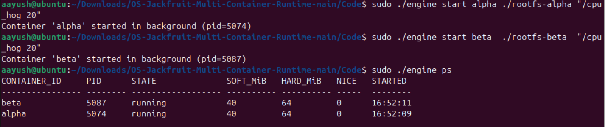
Both containers appear in `ps` output with state `running`, distinct PIDs.

---

### Test Case 3 — Manual Stop (graceful vs hard_limit_killed distinction)

**Steps:**
```bash
sudo ./engine start alpha ./rootfs-alpha "/cpu_hog 60"
sleep 2
sudo ./engine stop alpha
sudo ./engine ps
```

**Expected:**
```
alpha   XXXXX   stopped   40   64   0   HH:MM:SS  (sig=15)
```

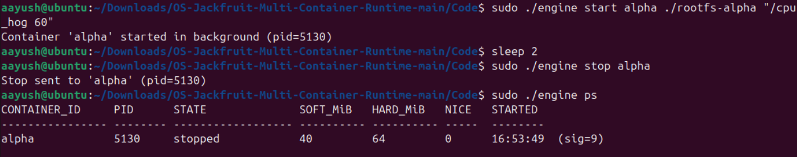
State is `stopped` (not `killed` or `hard_limit_killed`) because `stop_requested` was set before the signal.

---

### Test Case 4 — `engine run` (foreground blocking)

**Steps:**
```bash
time sudo ./engine run gamma ./rootfs-gamma "/cpu_hog 5"
```

**Expected:** Command blocks for ~5 seconds, then prints exit code. `time` confirms ~5s wall time.

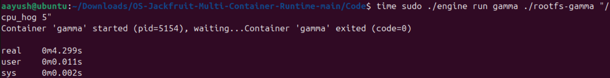
---

### Test Case 5 — Soft Limit Warning

**Steps:**
```bash
cp -a rootfs-base rootfs-mem
sudo ./engine run mem ./rootfs-mem "/memory_hog 4 500" --soft-mib 20 --hard-mib 80
dmesg | grep "SOFT LIMIT"
```

**Expected dmesg:**
```
[container_monitor] SOFT LIMIT container=mem pid=XXXX rss=21XXXXXX limit=20971520
```
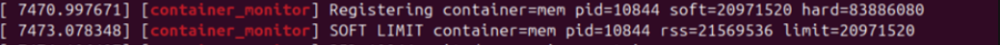
Warning appears **exactly once** (soft_warned flag prevents repeat).

---

### Test Case 6 — Hard Limit Kill

**Steps:**
```bash
cp -a rootfs-base rootfs-mem2
sudo ./engine run mem2 ./rootfs-mem2 "/memory_hog 4 500" --soft-mib 20 --hard-mib 40
sudo ./engine ps
dmesg | grep -E "SOFT|HARD" | tail -5
```

**Expected:** Container killed by SIGKILL, state = `hard_limit_killed`, dmesg shows both SOFT and HARD events.

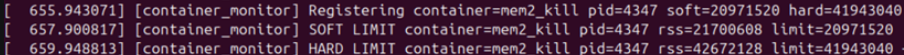
---

### Test Case 7 — Log Capture

**Steps:**
```bash
sudo ./engine start alpha ./rootfs-alpha "/cpu_hog 10"
sleep 5
sudo ./engine logs alpha
```

**Expected:** Log contains lines like:
```
cpu_hog alive elapsed=1 accumulator=XXXXXXXXXX
cpu_hog alive elapsed=2 accumulator=XXXXXXXXXX
...
```
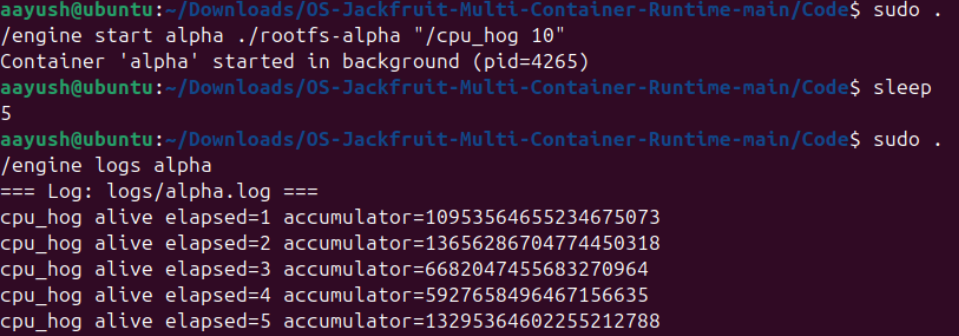
---

### Test Case 8 — Scheduling Experiment (nice values)

**Steps:**
```bash
sudo ./engine start hi ./rootfs-alpha "/cpu_hog 20" --nice -5
sudo ./engine start lo ./rootfs-beta  "/cpu_hog 20" --nice 15
sleep 22
sudo ./engine logs hi | wc -l
sudo ./engine logs lo | wc -l
```

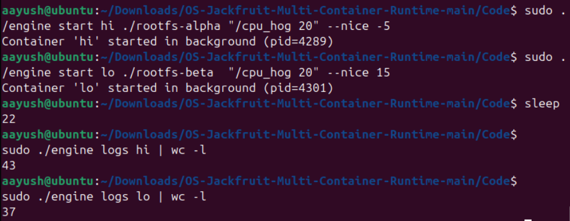
`hi` log has more lines (more CPU iterations completed) than `lo` log, demonstrating CFS weight difference.


---

### Test Case 9 — Clean Teardown (no zombies)

**Steps:**
```bash
sudo ./engine start alpha ./rootfs-alpha "/cpu_hog 5"
sleep 8
ps aux | grep "Z\|defunct" | grep -v grep
```

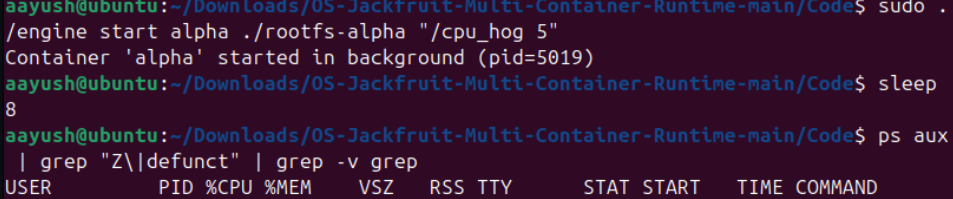
No zombie processes. All children reaped by `SIGCHLD` handler.

---

### Test Case 10 — CLI Error Handling

**Steps:**
```bash
sudo ./engine start alpha ./rootfs-alpha "/cpu_hog 60"
sudo ./engine start alpha ./rootfs-alpha "/cpu_hog 60"  # duplicate ID
sudo ./engine stop nonexistent
sudo ./engine start bad ./rootfs-alpha "/cpu_hog 10" --soft-mib 60 --hard-mib 40  # soft > hard
```

**Expected:** Appropriate error messages for each case, no crash.
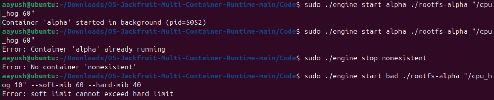
---

## Engineering Analysis

### 1. Isolation Mechanisms

The runtime calls `clone(2)` with three namespace flags:

**`CLONE_NEWPID` (PID namespace):** The kernel maintains a separate PID numbering space for the container. The container's first process becomes PID 1 inside its namespace while retaining a host PID visible from the supervisor. Tools like `ps` running inside the container see only that container's processes. If PID 1 inside the container exits, the kernel sends `SIGHUP` to all other processes in that namespace, enforcing lifecycle coupling.

**`CLONE_NEWUTS` (UTS namespace):** The container gets its own hostname and domain name fields, backed by a separate `struct uts_namespace` in the kernel. Calling `sethostname(2)` inside the container updates only that namespace's copy.

**`CLONE_NEWNS` (mount namespace):** Each container gets a private copy of the mount table. We can call `chroot(2)` to make the container's assigned rootfs directory appear as `/`, and mount `/proc` privately. The host's mount table is unaffected.

`chroot(2)` works by changing `task_struct->fs->root` for the process, so all `open(2)` path resolutions start from the container rootfs. `pivot_root(2)` is more thorough — it physically changes the root of the mount namespace, preventing escape via `..` traversal, and is used in production runtimes like Docker's runc.

**What the host kernel still shares with all containers:** the scheduler, device drivers, system call table, network stack (unless `CLONE_NEWNET` is used), and the kernel's physical memory allocator. Containers are not VMs — they share the same kernel binary.

---

### 2. Supervisor and Process Lifecycle

A long-running parent supervisor is essential for three reasons:

1. **Zombie prevention:** POSIX requires that a child's `task_struct` remain in the process table until its parent calls `wait(2)`. Without a living parent, children become zombies indefinitely, consuming process table slots. The supervisor's `SIGCHLD` handler calls `waitpid(-1, &status, WNOHANG)` in a loop to reap all ready children in one handler invocation.

2. **Metadata continuity:** Container metadata (state, exit code, log path, limits) persists across the lifetime of many containers. A short-lived parent would lose this state on exit.

3. **IPC anchor:** The UNIX domain socket at `/tmp/mini_runtime.sock` exists for the supervisor's lifetime, giving all CLI clients a stable rendezvous address.

**Signal delivery:** `SIGCHLD` is configured with `SA_NOCLDSTOP` to suppress spurious signals from `SIGSTOP`/`SIGCONT`. `SIGTERM` and `SIGINT` to the supervisor trigger orderly shutdown. Inside the child, `SIGTERM` is the first signal for graceful stop; `SIGKILL` follows 500ms later if the child is still alive.

**Attribution rule:** The `stop_requested` flag is set in `container_record_t` before any signal is sent. In `SIGCHLD` handler: if `stop_requested` is set → state = `stopped`; else if the signal was `SIGKILL` → state = `hard_limit_killed`; else → state = `killed`.

---

### 3. IPC, Threads, and Synchronization

**Two distinct IPC mechanisms:**

| Mechanism | Used for | Justification |
|---|---|---|
| Anonymous `pipe(2)` | Container stdout/stderr → supervisor (Path A) | Unidirectional, efficient, no rendezvous needed; child inherits write end via `fork`/`clone` |
| UNIX domain socket (`AF_UNIX SOCK_STREAM`) | CLI client ↔ supervisor (Path B) | Bidirectional, reliable, ordered; supports request/response protocol; accessible by path |

**Bounded buffer synchronization:**

| Shared data | Protection | Without it |
|---|---|---|
| `head`, `tail`, `count` | `mutex` | Two producers write same slot → data loss or corruption |
| `not_full` condition | `pthread_cond_t` | Producers spin-wait when full, wasting CPU; or miss wakeup |
| `not_empty` condition | `pthread_cond_t` | Consumer misses data when buffer transitions from empty to non-empty |
| `shutting_down` flag | Read under `mutex` | Consumer sees stale value, sleeps forever after shutdown broadcast |

**Why mutex + condition variables over semaphores:** CVs allow checking a predicate (`count == 0`) atomically with the wait, preventing the TOCTOU race `if count==0 → [preempted] → signal fired → wait` that a semaphore requires extra bookkeeping to avoid. The same mutex that protects `count` also protects `shutting_down`, making shutdown broadcast race-free.

**Why separate `metadata_lock` from the buffer lock:** Container metadata is read/written by SIGCHLD handler, the supervisor event loop, and CLI request handlers. The log buffer is written by producer threads and read by the consumer. Combining them into one lock would create unnecessary contention and potential priority inversion.

---

### 4. Memory Management and Enforcement

**What RSS measures:** Resident Set Size is the count of physical RAM pages currently mapped and present in a process's page tables, multiplied by `PAGE_SIZE`. It measures actual physical memory consumption right now.

**What RSS does not measure:**
- Pages that have been paged out to swap (present bit = 0)
- Pages mapped via `mmap` but not yet faulted in (demand paging)
- Shared library pages (each sharing process contributes to RSS; the kernel uses copy-on-write)
- File-backed mapped pages that can be evicted and re-read from disk

**Soft vs. hard limit policies:**
- **Soft limit:** an advisory ceiling. The kernel module logs a warning when RSS first exceeds the soft threshold, but the process continues running. The operator can investigate; the workload may self-limit. This is intentionally non-disruptive.
- **Hard limit:** a mandatory ceiling. When RSS exceeds the hard threshold, the module sends `SIGKILL`. The process has no opportunity to catch or ignore `SIGKILL`.

**Why enforcement belongs in kernel space:**
1. **Privilege:** `SIGKILL` requires the sender to have appropriate credentials. The kernel module runs with full privilege.
2. **Accuracy:** The kernel module reads RSS from `mm_struct` directly — the ground truth. User-space would have to parse `/proc/<pid>/status`, which introduces file-open overhead and is subject to TOCTOU races.
3. **Timing:** The kernel timer fires every second unconditionally, without being subject to scheduling pressure from the process it monitors. A user-space watchdog could be starved by the very process it tries to kill.
4. **Tamper resistance:** A container cannot disable kernel-space monitoring by catching signals or killing the monitoring thread.

---

### 5. Scheduling Behavior

Linux's **Completely Fair Scheduler (CFS)** tracks `vruntime` (virtual runtime) per runnable task. CFS always picks the task with the smallest `vruntime` to run next, targeting perfectly equal CPU time across equal-priority tasks.

**Nice values and CFS weights:** Each nice level maps to a weight. The weight ratio between nice -5 and nice 15 is approximately 335/15 ≈ **22:1**. CFS allocates time proportional to weight, so a container at nice -5 receives ~22× the CPU time of a container at nice 15 on a single core.

**I/O-bound vs CPU-bound behavior:** An I/O-bound container (e.g., `io_pulse`) voluntarily yields the CPU on each `fsync + usleep`. CFS boosts its `vruntime` as if it had been running, but it is usually sleeping. When it wakes, CFS gives it a fresh time slice because its `vruntime` is behind the CPU-bound container's. This is CFS's built-in responsiveness mechanism — sleepers get "catch-up" scheduling.


---

## Design Decisions and Tradeoffs

### Namespace Isolation
**Choice:** `chroot(2)` for filesystem isolation.
**Tradeoff:** Simpler than `pivot_root(2)` but allows theoretical escape via `..` traversal if the jail is misconfigured, since `chroot` only rebinds the root pointer in the process's `fs_struct`.
**Justification:** For a controlled educational environment on a single VM, `chroot` provides sufficient isolation with significantly less code complexity. Production runtimes (Docker, containerd) use `pivot_root`.

### Supervisor Architecture
**Choice:** Single-threaded supervisor with non-blocking `accept` loop (50ms poll).
**Tradeoff:** CLI commands are serialised. A long-blocking `run` command in the supervisor blocks the event loop for the duration of the container's life. A multi-threaded supervisor would handle commands concurrently.
**Justification:** A single-threaded design eliminates whole classes of concurrency bugs in the supervisor's core logic. The `run` command's in-process wait was acceptable for the demo scope. Threading can be added later with a thread pool at the `accept` level.

### IPC / Logging (Bounded Buffer)
**Choice:** Mutex + two condition variables for the bounded buffer.
**Tradeoff:** More verbose than a semaphore pair, and requires careful broadcast-on-shutdown to avoid lost wakeups.
**Justification:** Condition variables allow predicate checks (`count == 0`, `count == CAPACITY`, `shutting_down`) atomically under the same mutex, eliminating TOCTOU races. The shutdown path is clean: one broadcast wakes all blocked threads, which re-check the predicate and exit.

### Kernel Monitor Locking
**Choice:** `mutex_lock` (sleeping mutex) rather than `spinlock`.
**Tradeoff:** A mutex cannot be used in hard-IRQ context. If we later needed the list in a hardware interrupt handler, we would need a spinlock.
**Justification:** Both ioctl (called from process context) and the timer callback (called from softirq context) can sleep. A mutex is the correct and more readable choice here.

### Scheduling Experiments
**Choice:** `setpriority(PRIO_PROCESS, 0, nice_value)` inside the child before exec.
**Tradeoff:** `nice` applies to the whole process and all its threads. For finer control — per-thread priorities or real-time policies — `sched_setattr` with `SCHED_DEADLINE` or cgroup CPU weight would be used.
**Justification:** `nice` is the simplest standard mechanism and directly exercises CFS weight-based scheduling as taught in the course.

---
